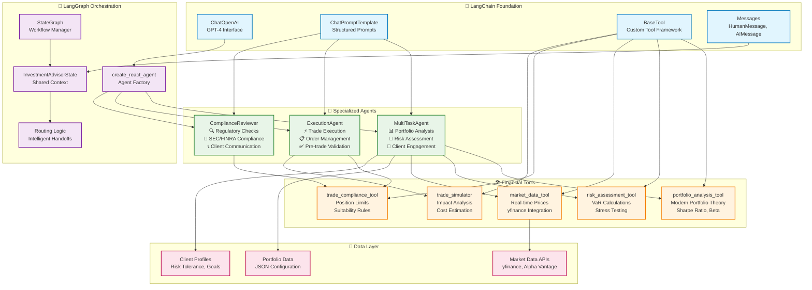
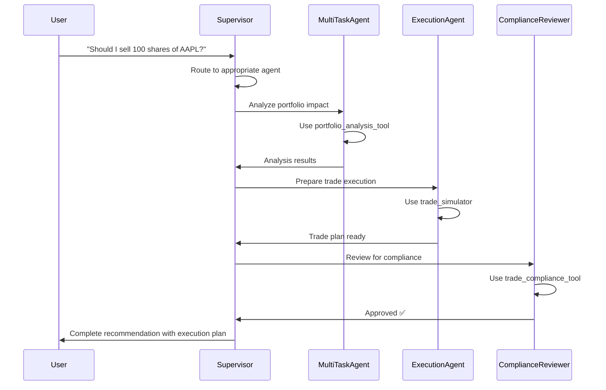

# AI Investment Advisor - System Architecture

## Overview
This system integrates **LangChain** (AI components) with **LangGraph** (multi-agent orchestration) to create a sophisticated investment advisory platform.

## Architecture Diagram



## Component Details

### 🧠 LangChain Foundation
- **ChatOpenAI**: Interface to GPT-4 for all natural language processing
- **ChatPromptTemplate**: Structured prompt engineering for consistent responses
- **BaseTool**: Framework for creating domain-specific financial tools
- **Messages**: Conversation history and state management

### 🔄 LangGraph Orchestration  
- **StateGraph**: Manages the multi-agent workflow and decision routing
- **create_react_agent**: Combines LangChain LLM with specialized tools
- **InvestmentAdvisorState**: Shared context across all agents
- **Routing Logic**: Intelligent agent handoffs based on request type

### 🤖 Specialized Agents
1. **MultiTaskAgent**: Primary interface for portfolio analysis and client interaction
2. **ExecutionAgent**: Handles trade execution with compliance validation
3. **ComplianceReviewer**: Ensures regulatory compliance and manages communications

### 🛠️ Financial Tools
- Portfolio analysis with modern portfolio theory
- Risk assessment including VaR and stress testing
- Real-time market data integration
- Trade compliance and suitability checking
- Trade simulation and impact analysis

## Workflow Example



## Key Integration Points

### File Locations
```
ai_investment_advisor/
├── core/
│   └── supervisor.py          # LangGraph + LangChain integration
├── agents/
│   ├── multi_task_agent.py    # LangChain agents
│   ├── execution_agent.py     # LangChain agents  
│   └── compliance_reviewer.py # LangChain agents
└── tools/
    ├── portfolio_analyzer.py  # LangChain BaseTool
    ├── risk_assessment.py     # LangChain BaseTool
    ├── market_data.py         # LangChain BaseTool
    └── trade_simulator.py     # LangChain BaseTool
```

### State Flow
1. **User Input** → LangChain Messages
2. **Routing** → LangGraph StateGraph  
3. **Processing** → LangChain Agents + Tools
4. **Coordination** → LangGraph State Management
5. **Response** → LangChain Formatted Output

## Benefits of This Architecture

- **Modularity**: Each agent specializes in specific financial domains
- **Scalability**: Easy to add new agents or tools
- **Reliability**: Built-in state management and error handling
- **Compliance**: Regulatory checks built into the workflow
- **Conversational**: Natural language interface for complex financial operations
